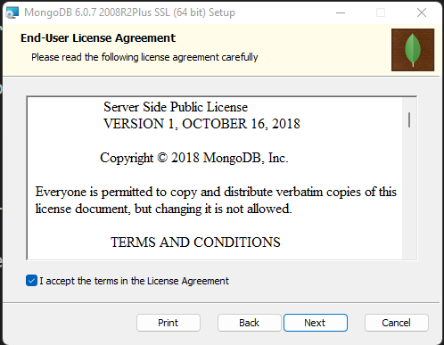
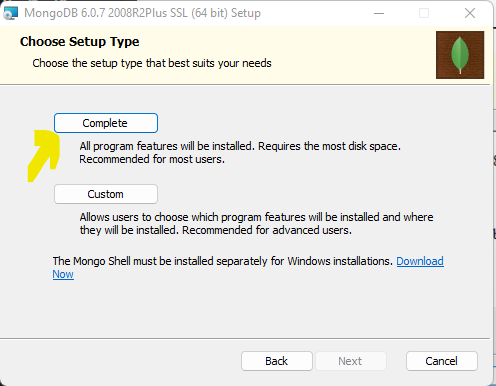
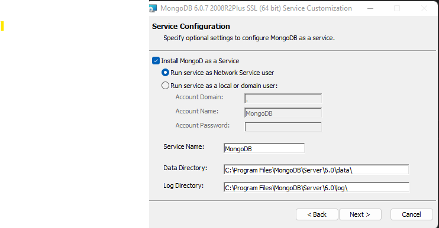
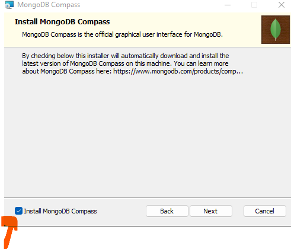
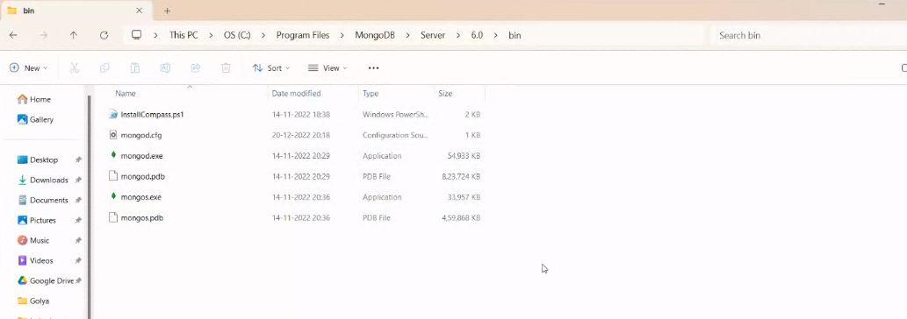
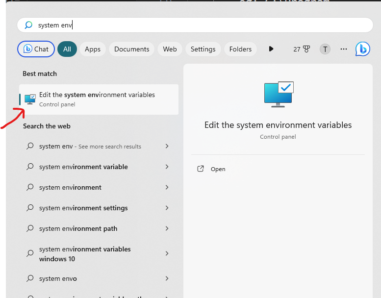
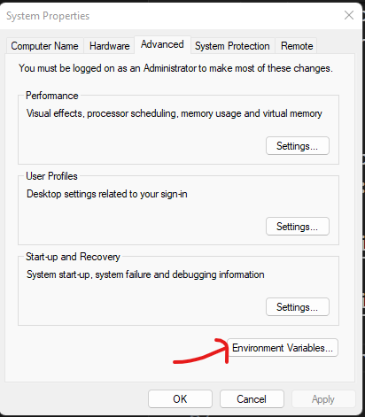
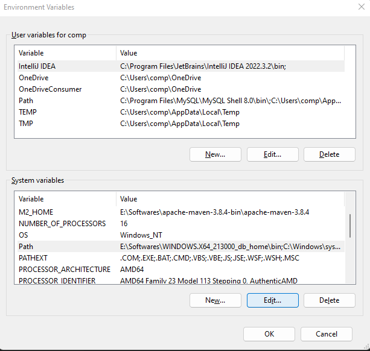
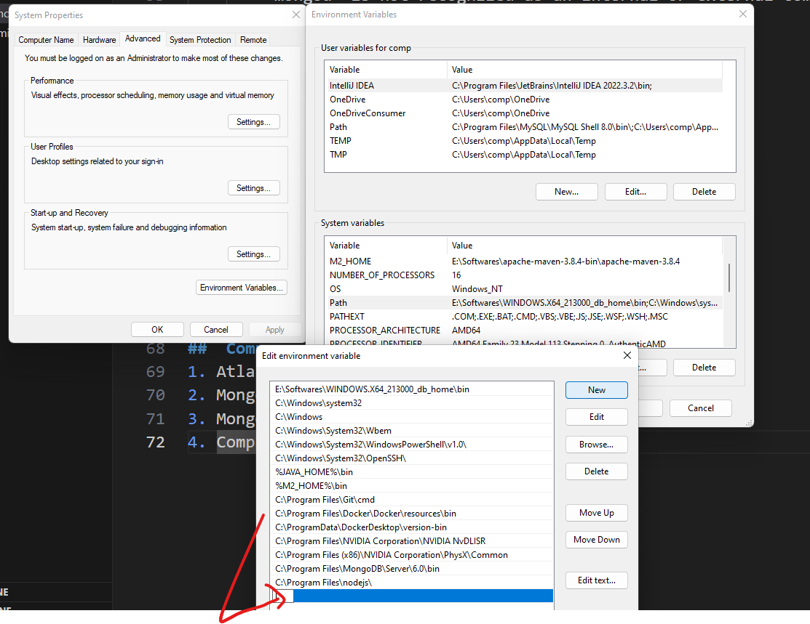

# NoSQL (Not only SQL)

## SQL vs NoSql
### SQL
1. RDBMS => data stored in table which have rows and columns
2. db have fixed or static or predefined schema

     Emp
     id     name       salary

3. DB are best suited for complex queries and need transaction
4. verically scalable
5. Follow ACID property

        Atomicity
        Consistency
        Isolation
        Durability

### NoSql 
1. Non -relation or distributed database system
2. Dynamic Schema
3. DB are not good for complex queries and need transaction
4. Horizontally scalable
5. Follow Base property
    
        BA Basically Available
        Soft State
        Eventual consistency

#  Install MongoDB
## step 1: download mongodb msi installer
    https://fastdl.mongodb.org/windows/mongodb-windows-x86_64-6.0.7-signed.msi

click to the installer

click on the complete

## Step no 2: set the path in system environment variable
1. Open cmd and execute mongod, first time user will get the error message as below

        'mongod' is not recognized as an internal or external command,
operable program or batch file.

2. set the path

        copy the path of mongodb/bin
        eg: C:\Program Files\MongoDB\Server\6.0\bin

click on the environment variable and set the path of bin folder in Path variable as in diagram.

Apply the changes.
close the env window and cmd.

## step 3: download mongo shell
https://downloads.mongodb.com/compass/mongosh-2.1.1-win32-x64.zip

unzip the zip file and open the bin folder.

##  Component:
1. Atlas:
2. Mongo
3. MongoD
4. Compass