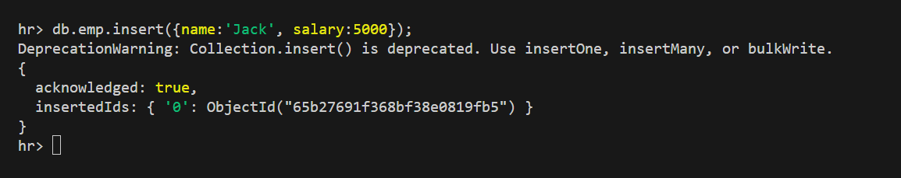
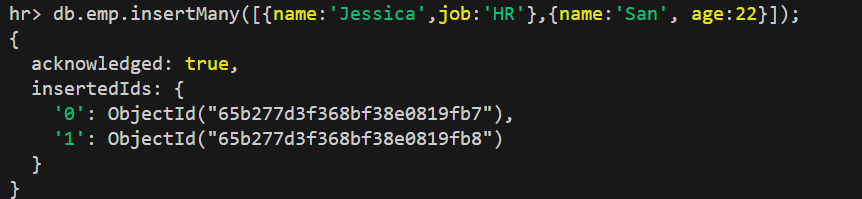

## commands 
                SQL		        MongoDB	
                ----------------------------------
                Database		Database	
                Table		        Collection	
                Row		        Document	
                Column		        Field	

### display database list
        > show dbs

### create database
        > use <database_name>
        create and move inside the db
        or if db exists then move inside the db

### drop database
        > db.dropDatabase();

                seed> db.dropDatabase();
                { ok: 1, dropped: 'seed' }

### create collecton / table
        > db.createCollection(<collection_name>)
        eg: db.createCollection('student');

### display the list of collections
        > show collections

### display the content in the collection
        > db.<collection_name>.find();

### insert the row(s) in the collection
        >db.<collection_name>.insert({object}); //insert is deprecated

        >db.<collection_name>.insertOne({object});
        db.<collection_name>.insertMany([{object1}, {object2}, {object3},...]);

        object mean key,value pair as we write in js

        eg: db.emp.insertOne({name:'Jackson', salary:5000});
        eg: db.emp.insertMany([{name:'Jessica',job:'HR'},{name:'San', age:22}]);

## drop the collection
    db.<collection_name>.drop();

## project or selection
    db.<collection_name>.find({filter}, {projection});

### display id,item and qty (inventory collection)
    db.inventory.find({}, {item:1, qty:1});

## operator

### equal operator ($eq)
1. fetch the document with qty = 10

            db.inventory.find({qty:10});
            db.inventory.find({qty: {$eq:10}});

            

2.  waq to find the record with name = 'ij';

        db.inventory.find({'item.name': {$eq:'ij'}});

### $ne
    db.inventory.find({qty: {$ne:10}});
    db.inventory.find({qty: {$ne:10}}, {qty:1}); //select only _id and qty
